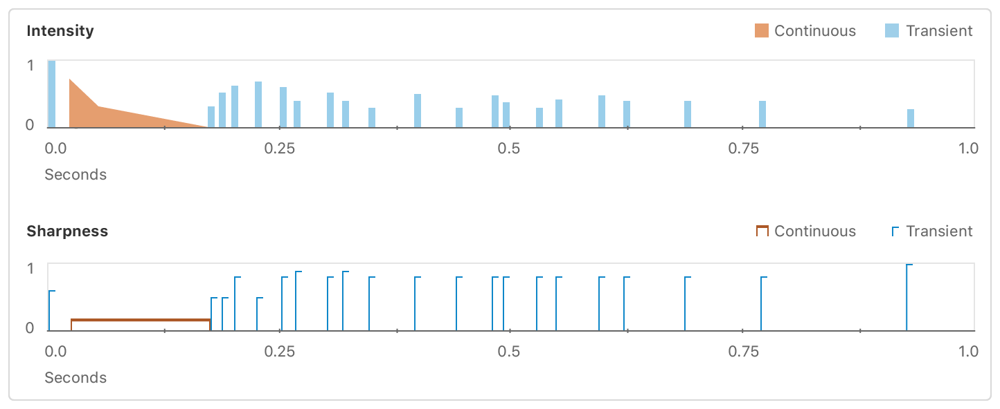

# Playing a Custom Haptic Pattern from a File

Sample predesigned Apple Haptic Audio Pattern files, and learn how to play your own.

## Overview

This app, HapticSampler, describes how to load files formatted as Apple Haptic Audio Pattern (AHAP). AHAP files are JSON-compliant dictionary representations of haptic and audio patterns that you can compose in a text editor, or any program that exports content in the JSON format.

The user interface, defined in `Main.storyboard`, consists of eight buttons, each of which loads and plays a different haptic pattern. AHAP files for eight custom patterns are bundled in the Xcode project. For example, the Sparkle.ahap file defines a haptic pattern with the following intensity and sharpness variations:



You can examine and modify the AHAP file parameters in Xcode or a text editor.

- Note: HapticSampler requires Xcode 11 or later. Simulator doesn’t support a haptic interface, so build and run this sample on an iPhone 8, 8 Plus, X, XR, XS, or XS Max running iOS 13 or later.

## Configure the App to Play Haptics

HapticSampler checks for device compatibility and sets up an instance of [`CHHapticEngine`](https://developer.apple.com/documentation/corehaptics/chhapticengine) on launch.

``` swift
// Create and configure a haptic engine.
do {
    engine = try CHHapticEngine()
} catch let error {
    print("Engine Creation Error: \(error)")
}
```

See [`Preparing Your App to Play Haptics`](https://developer.apple.com/documentation/corehaptics/preparing_your_app_to_play_haptics) for more information about setting up the engine.

## Start the Haptic Engine

All AHAPs in the sample are included in the app bundle, so build a URL to the desired file by searching in the main bundle, as you might do for other included assets like audio files.

``` swift
// Express the path to the AHAP file before attempting to load it.
guard let path = Bundle.main.path(forResource: filename, ofType: "ahap") else {
    return
}
```

Tap one of the buttons in the app to load the AHAP file associated with that button. Because the engine may not be started at that time, the app starts the engine as soon as a button is tapped.

``` swift
// Start the engine in case it's idle.
try engine.start()
```

## Play the AHAP

Assuming the engine has started, call the engine’s method, [`playPattern`](https://developer.apple.com/documentation/corehaptics/chhapticengine/3043659-playpattern), passing it the URL to playing the file.

``` swift
// Tell the engine to play a pattern.
try engine.playPattern(from: URL(fileURLWithPath: path))
```
[View in Source](x-source-tag://PlayAHAP)      

This method of playback follows a *fire & forget* model; each haptic pattern plays until it reaches its end, then stops automatically.

Once the haptic starts playing, you can't stop it, and pressing other buttons layers those haptics on top of any existing haptic patterns in the middle of playback. This layering allows you to combine a haptic pattern with a more continuous intent, like the rumble of thunder, with a more impulse-driven haptic pattern built from transient taps, like the strike of lightning.

Core Haptics layers simultaneously playing haptics automatically. If you don't want the layering, your app should wait out the duration of the first haptic before starting subsequent haptic players.

- Note: Haptic patterns don’t blend like audio waveforms, and not all combinations produce a discernible effect. Playing two haptic events of the same type at the same time makes them hard to tell apart. Experiment with various combinations to ensure that the result feels right.

## Create Advanced Pattern Players for More Granular Control

To get more granular control over individual haptics, such as looping, or starting and stopping playback at specific times, create and maintain advanced pattern players using [`CHAdvancedPatternPlayer`](https://developer.apple.com/documentation/corehaptics/chhapticadvancedpatternplayer) instead of using [`playPattern`](https://developer.apple.com/documentation/corehaptics/chhapticengine/3043659-playpattern).

``` swift
self.advancedPlayer = try! self.hapticEngine.createAdvancedPlayer(with:ahapPattern!)
self.advancedPlayer?.loopEnabled = true
```

## Compose Your Own Haptic

To compose your own haptic pattern, begin by modifying one of the AHAP files included in the project. You can copy components of it for producing a transient haptic pattern or a continuous haptic pattern, then build your own haptic by combining and modifying those pieces.

Alternatively, you can write an AHAP file from scratch in a text editor, using the example AHAP files as a reference for proper nesting of event, pattern, and parameter dictionaries. For more information about the AHAP file format and the parameter keys that the format supports, see Representing Haptic Patterns in AHAP Files.
